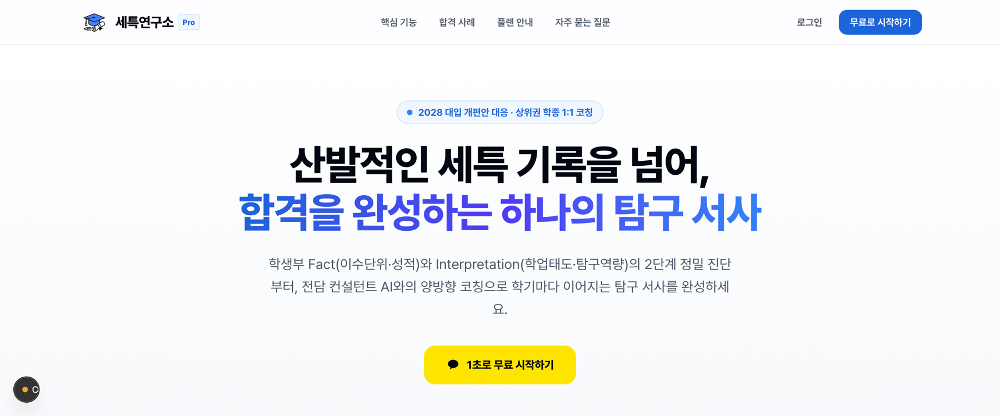
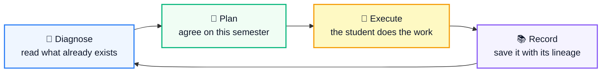
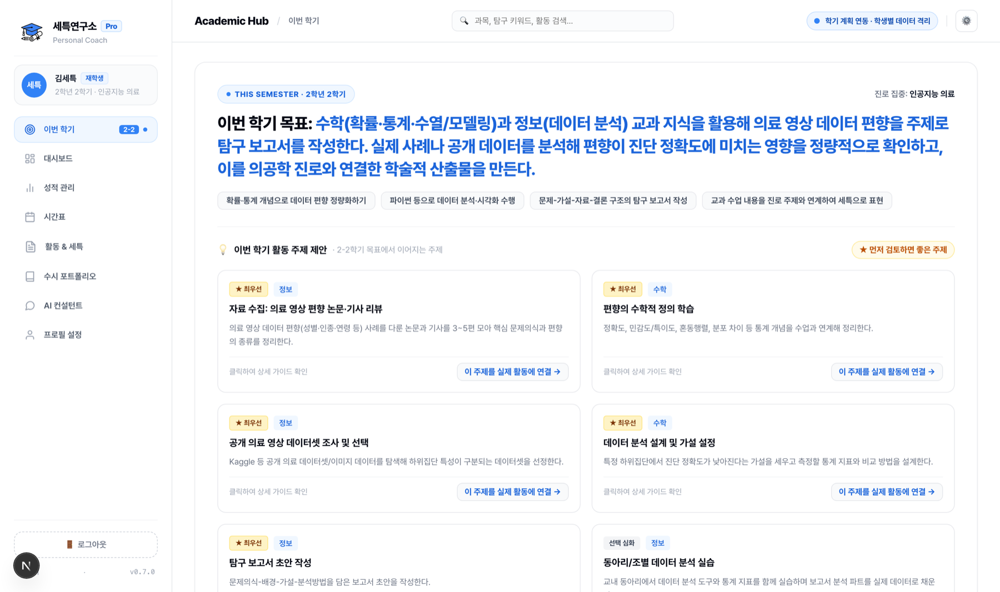
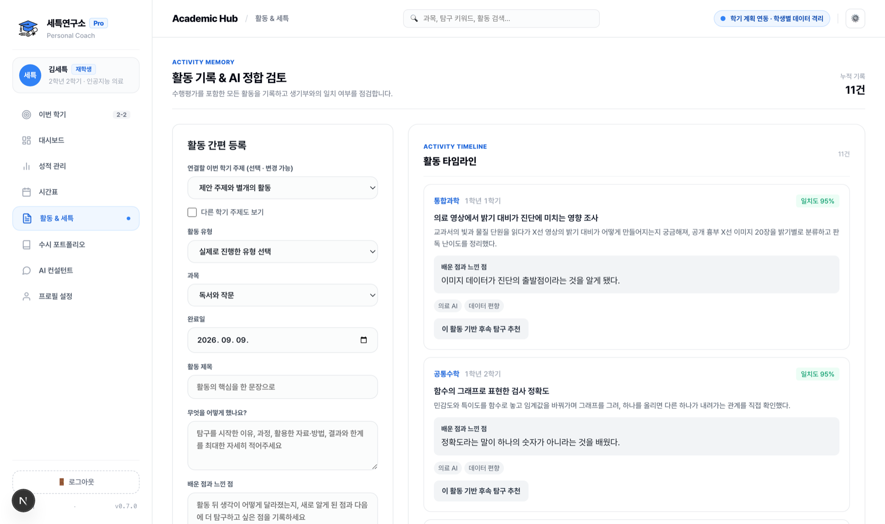
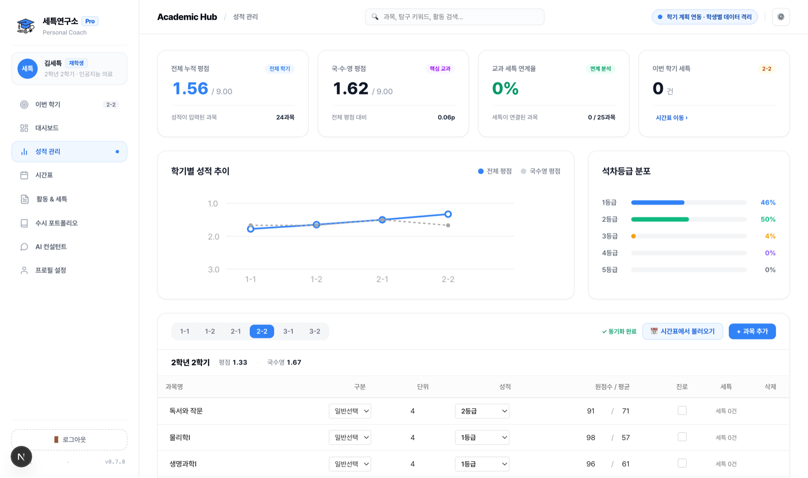
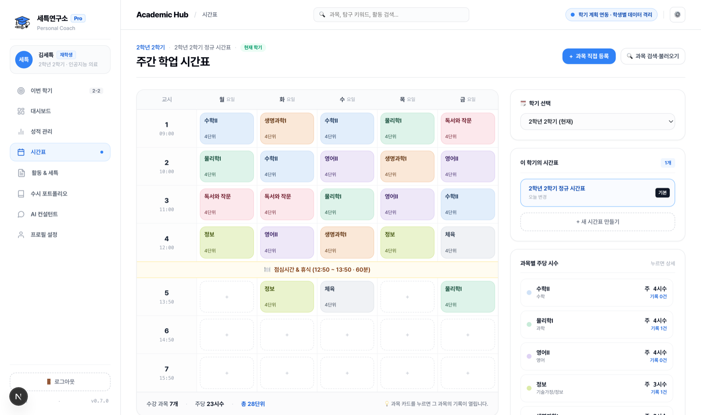
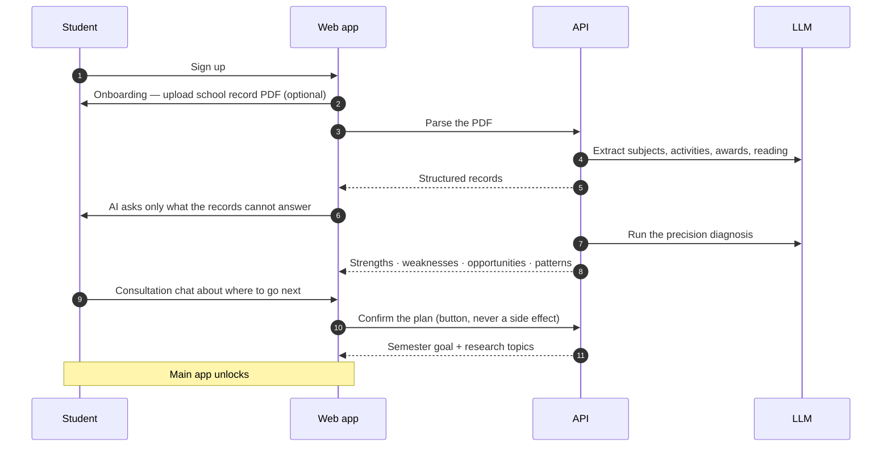
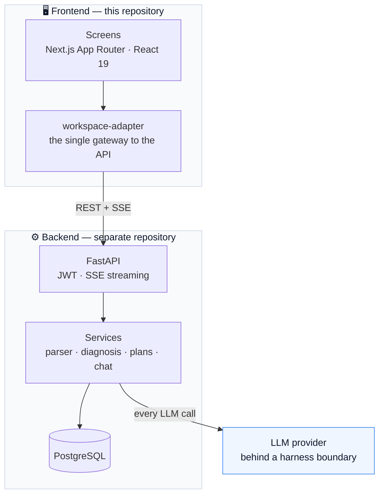

<div align="center">


# 세특연구소 · Seteuk Lab

**An AI coach that turns three years of scattered high‑school activity notes
into one coherent research narrative.**

[](https://nextjs.org)
[](https://react.dev)
[](https://www.typescriptlang.org)
[](https://tailwindcss.com)
[](https://fastapi.tiangolo.com)


<sub>The product UI is in Korean — it is built for Korean high‑school students.<br/>
This repository is the **web frontend**. The API lives in a separate backend repository.</sub>



</div>

---

## What problem is this solving?

Korean university admissions lean heavily on the **학교생활기록부** (*school record*) — and
inside it, the **세부능력 및 특기사항** (*"se‑teuk"*: the teacher‑written remarks about what a
student actually did in each subject).

Over three years a student accumulates dozens of these entries: reports, experiments,
club projects, reading logs, competitions. Individually each one is fine. The problem is
that **admissions officers read them as a story**, and most students have no story —
just a pile of disconnected activities, because nobody is tracking how last semester's
report should have led to this semester's project.

Keeping that thread is genuinely hard for a 16‑year‑old. That is the job this app does.

## The loop

The product is not a chatbot with a school theme. It is one closed loop, and every
screen is a step in it.



What makes the loop hold together is **activity lineage**. Every record can point at the
activity it grew out of (`parent_activity_id`), and every plan remembers which record it
came from. So the system can answer the question a general‑purpose chatbot cannot:

> *"You hit the limits of an exponential model last semester. Do you want to take that
> further with a logistic one, or widen it instead?"*

## Screens

<table>
<tr>
<td width="50%" valign="top">

### This Semester
The goal agreed on during the consultation, plus the research topics that follow from
it. Each card converts into a real activity record in one click.



</td>
<td width="50%" valign="top">

### Activities & Se‑teuk
Every activity with what the student learned, its keywords, and how well it matches the
semester plan. **Follow‑up research is proposed from the activity's own lineage**, not
from a blank prompt.



</td>
</tr>
<tr>
<td width="50%" valign="top">

### Grades
Weighted GPA, per‑semester trend, and rank distribution — all computed from records the
student actually entered. Nothing is filled in on their behalf.



</td>
<td width="50%" valign="top">

### Timetable
The weekly schedule doubles as the course list: pick a subject and you see the records
filed under it, then jump straight to writing the next one.



</td>
</tr>
</table>

Also in the app: an **onboarding flow** that reads an uploaded school‑record PDF, a
**diagnosis + consultation gate** that must be cleared before the main app unlocks, a
**portfolio view** for admissions season, and a **chatbot with an edit mode** that can
write records straight from conversation.

## How a student moves through it



The gate is deliberate. A student who has not been diagnosed has no basis for a plan, so
`/roadmaps`, `/plans`, `/recommendations` and general chat stay locked until the
consultation is concluded — **by an explicit button press, never by the chatbot deciding
on its own.**

## Architecture



Two rules keep the split clean:

- **The frontend never calls a model directly.** Every LLM call goes through the backend,
  because that is where the provider boundary and the per‑user daily quotas live.
- **API types are generated, not written.** `lib/api-types.ts` comes from the backend's
  `/openapi.json` via `openapi-typescript`, so a backend change surfaces as a compile
  error instead of a runtime surprise.

### Stack

| Layer | Choice |
|---|---|
| Framework | Next.js 16 (App Router), React 19, TypeScript 5.9 |
| Styling | Tailwind CSS v4 utilities over a hand‑written design system (Pretendard, Toss‑inspired tokens) |
| API | FastAPI · Python 3.12 · SQLAlchemy 2.0 (async) · Alembic |
| Database | PostgreSQL |
| Auth | JWT access + refresh, Kakao social login |
| Streaming | Server‑Sent Events for the chatbot (parsed from `fetch`, so the request can carry an auth header) |
| LLM | Chosen per environment behind a provider boundary in the backend — the same call sites serve parsing, diagnosis, planning, recommendations and chat |

## Getting started

Requires **Node ≥ 22.13** and a running backend.

```bash
npm ci
npm run dev
```

Create `.env.local` if your backend is not on the default origin:

```bash
NEXT_PUBLIC_API_BASE_URL=http://127.0.0.1:8000
NEXT_PUBLIC_KAKAO_JS_KEY=          # optional — no key means no Kakao button
```

Then:

```bash
npm run typecheck   # tsc --noEmit
npm test            # screen contract tests
npm run lint
```

Regenerate API types after a backend change:

```bash
npx openapi-typescript http://127.0.0.1:8000/openapi.json -o lib/api-types.ts
```

## Project layout

```
app/
  workspace-app.tsx      # shell, this-semester, activities, portfolio, profile
  gate-frame.tsx         # full-screen frame for onboarding and the gate
  consultation-view.tsx  # diagnosis report + consultation chat
  grades-view.tsx        # GPA, trend, rank distribution, grade table
  timetable-view.tsx     # weekly grid + course drawer
  chat-view.tsx          # chatbot with edit mode
  chat-thread.tsx        # shared bubbles + composer
  landing-view.tsx       # signed-out marketing page
  globals.css            # design tokens + component styles
lib/
  workspace-adapter.ts   # the only place that talks to the backend
  api-client.ts          # auth, refresh, binary downloads
  api-types.ts           # generated from the backend's OpenAPI schema
docs/
  DESIGN_MIGRATION.md    # design decisions and what is deliberately not built
```

## Status

Working prototype, verified end‑to‑end against a real backend and a real model key —
sign‑up through onboarding, school‑record parsing, diagnosis, consultation, records,
follow‑up recommendations and the chatbot. Not deployed publicly yet.

Known gaps are tracked honestly in [`docs/DESIGN_MIGRATION.md`](docs/DESIGN_MIGRATION.md).
The most visible one: the figures on the signed‑out landing page are placeholders, kept
in a single file (`app/landing-content.ts`) behind an `IS_PLACEHOLDER` flag so they
cannot ship by accident.

Payments and subscriptions are intentionally out of scope.
